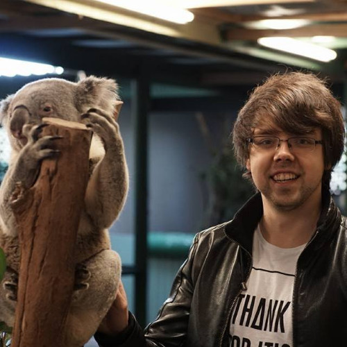
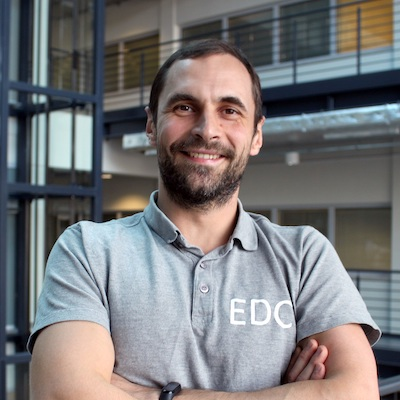
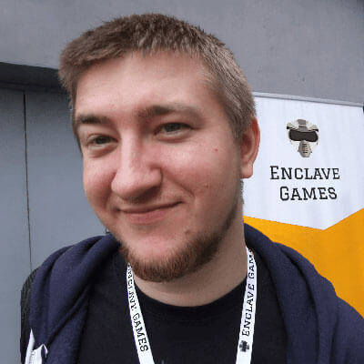

background-image: url(images/Facebook_1920x1080px.jpg)
background-size: contain

---

class: middle
background-image: url(images/blank.png)
background-size: contain

# Wi-Fi

## SSID: `ConFrontJS-guest`

---

class: middle
background-image: url(images/blank.png)
background-size: contain

Tweet with hashtag:

# #confrontjs

---

class: sponsors, slide-grid, slide-grid-4-columns, slide-blank
background-image: url(images/blank.png)
background-size: contain

# Sponsors

.grid-board[

]

---

class: middle, item-in-agenda
background-image: url(images/blank.png)
background-size: contain

# Registration

08:00 — 9:30 .slim[(1h 30min)]

---

class: middle, item-in-agenda
background-image: url(images/blank.png)
background-size: contain

# Opening .slim[by MC]

09:30 — 09:45 .slim[(15min)]

---

class: middle, item-in-agenda
background-image: url(images/blank.png)
background-size: contain

## Tomasz Łakomy **Sleeping better at night**

09:45 — 10:25 .slim[(40min)]

---

class: middle, item-in-agenda
background-image: url(images/blank.png)
background-size: contain

## Eleftheria Batsou **When you think there is not time for learning or coding**

10:25 — 10:55 .slim[(30min)]

---

class: middle, item-in-agenda
background-image: url(images/blank.png)
background-size: contain

# Coffee Break

10:55 — 11:10 .slim[(15min)]

---

class: middle, item-in-agenda
background-image: url(images/blank.png)
background-size: contain

## Tetiana Platonova **The Importance of Clean Code**

11:10 — 11:50 .slim[(30min)]

---

class: middle, item-in-agenda
background-image: url(images/blank.png)
background-size: contain

## Jerbi Saif **Mastering Reactive Programming with RxJS**

11:50 — 12:20 .slim[(30min)]

---

class: middle, item-in-agenda
background-image: url(images/blank.png)
background-size: contain

# Lunch

12:20 — 13:10 .slim[(50min)]

---

class: middle, item-in-agenda
background-image: url(images/blank.png)
background-size: contain

## Przemysław Zych **Should I fire my DevOps already? Build your infrastructure using TypeScript**

13:10 — 13:40 .slim[(30min)]

---

class: middle, item-in-agenda
background-image: url(images/blank.png)
background-size: contain

## Wojciech Jureczka **How to change mindset of coworkers?**

13:40 — 14:10 .slim[(30min)]

---

class: middle, item-in-agenda
background-image: url(images/blank.png)
background-size: contain

# Activity Break

14:10 — 14:25 .slim[(15min)]

---

class: middle, item-in-agenda
background-image: url(images/blank.png)
background-size: contain

## Piotr Tomiak **How to help your editor love your Vue component library**

14:25 — 14:55 .slim[(30min)]

---

class: middle, item-in-agenda
background-image: url(images/blank.png)
background-size: contain

## Andrzej Mazur **The past, present, and the future of HTML5 game development**

14:55 — 15:25 .slim[(30min)]

---

class: middle, item-in-agenda
background-image: url(images/blank.png)
background-size: contain

# Sponsors Break

15:25 — 15:40 .slim[(15min)]

---

class: middle, item-in-agenda
background-image: url(images/blank.png)
background-size: contain

# Bonus Lightning Talk

15:40 — 15:45 .slim[(5min)]

---

class: middle, item-in-agenda
background-image: url(images/blank.png)
background-size: contain

## Yonatan Kra **How close is your data?**

15:45 — 15:50 .slim[(5min)]

---

class: middle, item-in-agenda
background-image: url(images/blank.png)
background-size: contain

## Elad Shechter **Mobile First? Desktop First? Basic First - A New Approach for Responsive Design**

15:50 — 15:55 .slim[(5min)]

---

class: middle, item-in-agenda
background-image: url(images/blank.png)
background-size: contain

## Yonatan Doron **Microinteractions: Little Things That Matter**

15:55 — 16:00 .slim[(5min)]

---

class: middle, item-in-agenda
background-image: url(images/blank.png)
background-size: contain

## Nadia Ginalska **The sweet allure of a full rewrite**

16:00 — 16:05 .slim[(5min)]

---

class: middle, item-in-agenda
background-image: url(images/blank.png)
background-size: contain

## Jan Salwowski **Tips for maintainable Vue code**

16:05 — 16:10 .slim[(5min)]

---

class: middle, item-in-agenda
background-image: url(images/blank.png)
background-size: contain

## Tymon Terlikiewicz **Lessons learned migrating from a monolith frontend**

16:10 — .slim[(5min)]

---

class: middle, item-in-agenda
background-image: url(images/blank.png)
background-size: contain

## Roy Derks **Web applications of the future with TypeScript and GraphQL**

16:15 — 16:45 .slim[(30min)]

---

class: middle, item-in-agenda
background-image: url(images/blank.png)
background-size: contain

## Chris Heilmann **Into the web multiverse**

16:45 — 17:25 .slim[(40min)]

---

class: middle, item-in-agenda
background-image: url(images/blank.png)
background-size: contain

## Final **Contest’s winner announcement**

17:25 — 17:30 .slim[(5min)]

---

class: middle, item-in-agenda
background-image: url(images/blank.png)
background-size: contain

# After Party

17:30 — 18:30 .slim[(1hour)]
